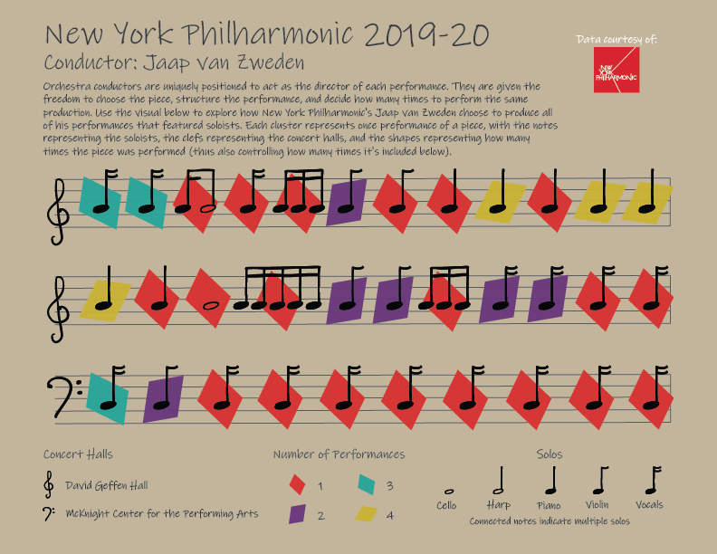

# New York Philharmonic

This project focuses on the performances conducted by a single conductor during the 2019-20 season of the New York Philharmonic. 
It aims to focus on the stylistic choices of the conductor in terms of the solos and pieces performed. It also references the 
concert hall in which each piece was performed to further illustrate how the delivery and experience of each performance may differ. 
By representing each performance individually, using the small multiples technique, the viewer can just begin to understand the 
conductor chooses to interact with their music.

