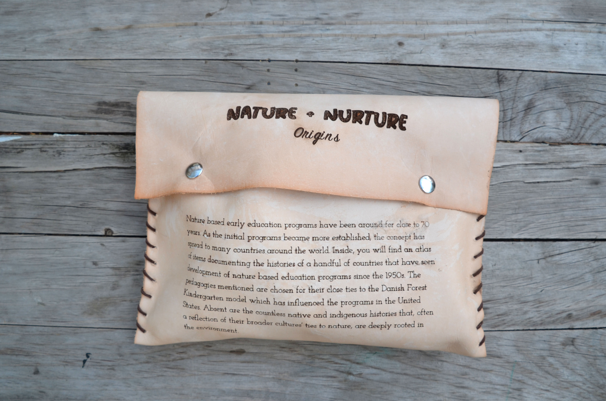
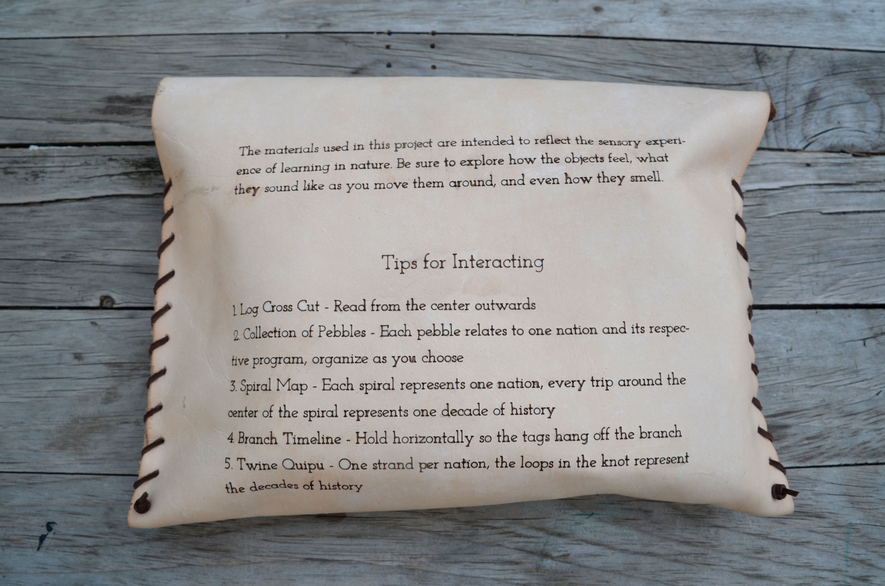
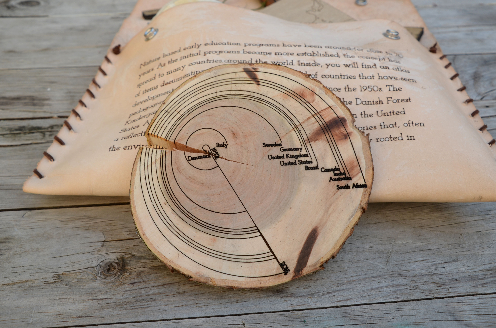
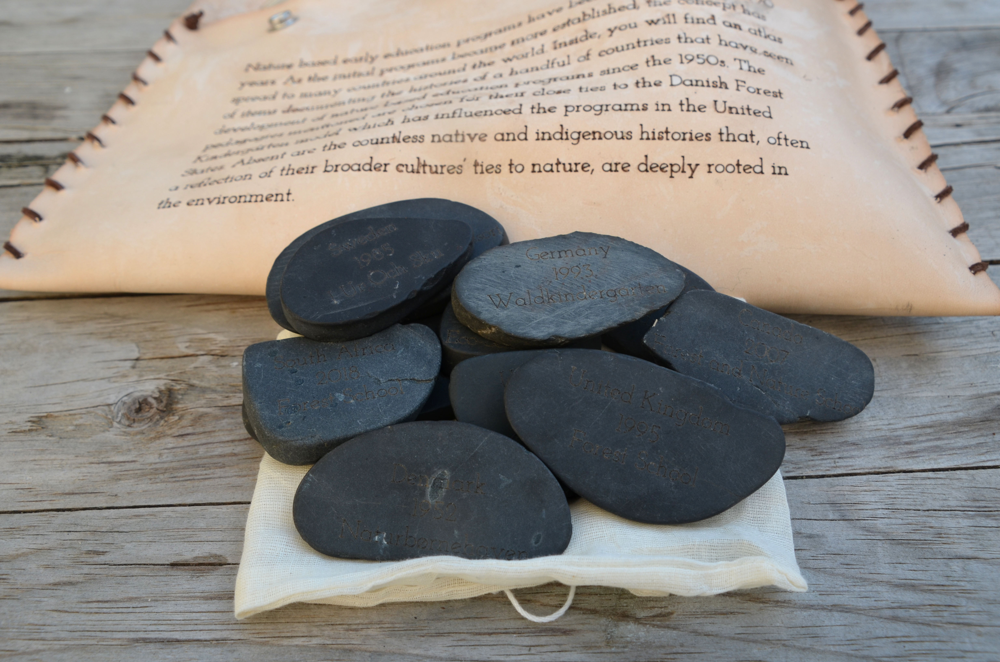
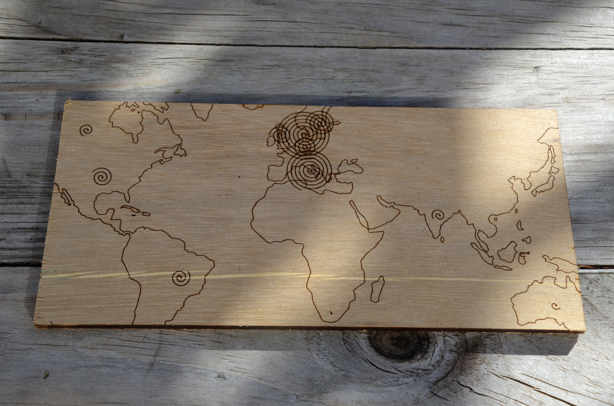
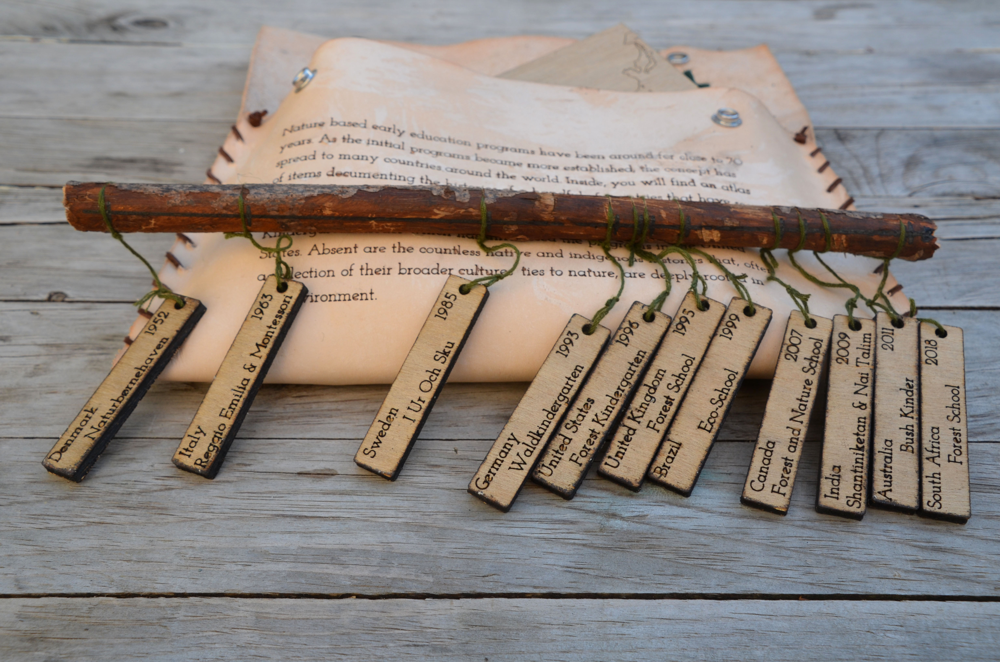
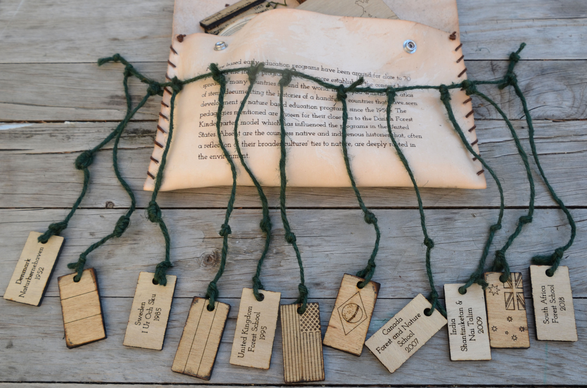

# Nature + Nurture: Origins

Origins is an extension of the larger Nature + Nurture thesis project. It focuses specifically 
on the history of nature based learning around the world and is represented in a physcial form. 
The project is an atlas of 1 noteworthy countries that are developing various types of outdoor 
education. The materials used are intentionally chosen to reflect the natural materials one would 
interact with in a Forest Kindergarten. In this way, the project is meant to supplement the 
digital thesis by providing the sensory experience of touching  and smelling the elements.

